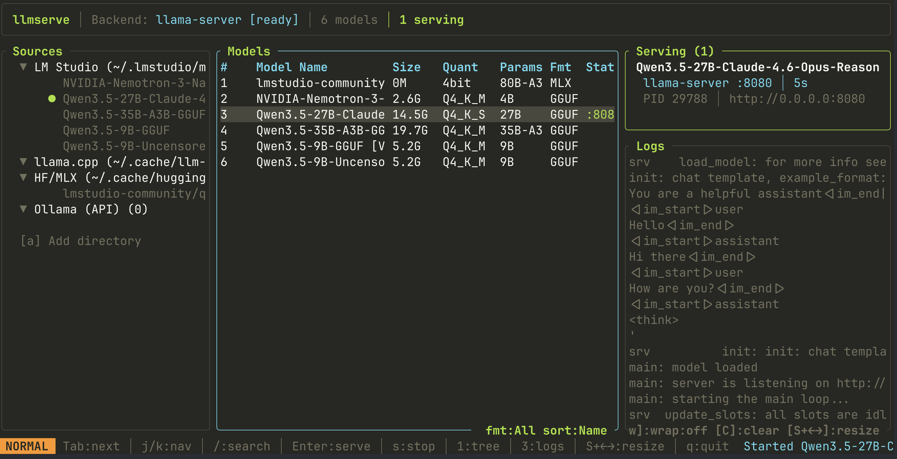

# llmserve

<p align="center">
  
</p>

<p align="center">
  <a href="https://github.com/AlexsJones/llmserve/actions/workflows/ci.yml"></a>
  <a href="https://crates.io/crates/llmserve"></a>
  <a href="LICENSE"></a>
</p>

**Any model. Any backend. One TUI to serve them all.**

If you're like me, you've got dozens of GGUF and MLX models scattered across LM Studio, HuggingFace cache, and random directories — and you want to quickly spin one up with whichever inference engine happens to be installed. llmserve is the front door for that. It finds your models, finds your backends, and gets out of the way.

It auto-detects locally installed inference engines (llama-server, KoboldCpp, LocalAI, MLX, and more), discovers model files across multiple locations, and lets you launch servers with live log output — all from a single interactive TUI. No config files to write, no CLI flags to remember.

> **Sister project:** Use [llmfit](https://github.com/AlexsJones/llmfit) to figure out *which* models fit your hardware, then use llmserve to actually *run* them.



---

## Install

### Quick install (macOS / Linux)
```sh
curl -fsSL https://llmserve.axjns.dev/install.sh | sh
```

### Homebrew
```sh
brew tap AlexsJones/llmserve
brew install llmserve
```

### Cargo
```sh
cargo install llmserve
```

### From source
```sh
cargo install --path .
```

---

## Usage

```
llmserve
```

The TUI has three panels:

| Panel | Position | Toggle | Description |
|-------|----------|--------|-------------|
| **Sources** | Left | `1` | File tree of model locations with counts and serving indicators |
| **Models** | Center | Always on | Searchable, sortable model table with serve status |
| **Serve/Logs** | Right | `3` | Running server cards + live backend output logs |

Focus cycles between visible panels with `Tab`. Resize the focused panel with `Shift+Left`/`Shift+Right`.

### Keybindings

| Key | Action |
|-----|--------|
| `Tab` | Cycle focus: Sources -> Models -> Logs |
| `1` / `3` | Toggle sources / logs panel |
| `j`/`k` | Navigate (works in focused panel) |
| `g`/`G` | Jump to top / bottom |
| `Ctrl-d`/`Ctrl-u` | Half page down / up |
| `Shift+Left`/`Right` | Resize focused panel |
| `Enter` | Models: open serve dialog / Sources: filter by source |
| `Space` | Sources: expand/collapse node |
| `a` | Add model directory (with tab-completion) |
| `x` | Remove custom directory (sources panel) |
| `/` | Search / filter models by name |
| `b` | Pick default backend |
| `f` | Cycle format filter (All / GGUF / MLX) |
| `o` | Cycle sort (Name / Size / Source) |
| `s` | Stop a server |
| `S` | Stop all servers |
| `w` | Toggle log word wrap |
| `C` | Clear dead server logs |
| `r` | Refresh models and backends |
| `t` | Cycle theme |
| `q` | Quit |

### Serve dialog

When you press `Enter` on a model, a confirmation dialog opens:

| Key | Action |
|-----|--------|
| `h`/`l` or `Left`/`Right` | Cycle through backends (shows availability + already-serving status) |
| `p` or `Tab` | Edit port number |
| `m` | Toggle between preset context and the model's detected max context |
| `Enter`/`y` | Launch server |
| `Esc`/`n` | Cancel |

The dialog shows the resolved preset for the selected backend plus the model's detected max context when metadata is available. The popup starts on the backend preset by default, and `m` opts into the model's detected max context for the current launch.

---

## Features

- **Auto-detects inference backends** — llama-server, KoboldCpp, LocalAI, MLX (Apple Silicon), Ollama, vLLM, LM Studio
- **Source tree** — collapsible file tree showing all model locations with model counts and green dots for serving models
- **Add directories live** — press `a`, type a path with tab-completion, and the directory is scanned immediately and persisted to config
- **Filter by source** — click a source in the tree to show only its models
- **Per-backend presets** — context size, batch size, GPU layers, threads, and extra CLI args per backend
- **Serve multiple models** — run different models on different backends simultaneously, each on its own auto-assigned port
- **Live log output** — stdout/stderr from inference backends streams into the logs panel in real-time with color-coded error/warning highlighting
- **Crash diagnostics** — when a server exits, its logs are preserved so you can see exactly what went wrong
- **Word wrap** — press `w` to wrap long log lines in the logs panel
- **Resizable panels** — Shift+arrows to grow/shrink any focused panel
- **Toggleable panels** — `1` hides/shows sources, `3` hides/shows logs
- **7 themes** — Default, Dracula, Solarized, Nord, Monokai, Gruvbox, Catppuccin Mocha
- **Vision model support** — auto-detects `mmproj` projector files and passes `--mmproj` to llama-server

---

## Configuration

Config lives at `~/.config/llmserve/config.toml`. Created automatically on first run.

```toml
# Extra directories to scan for model files
extra_model_dirs = [
    "/path/to/more/models",
]

# Global defaults
preferred_port = 8080
preferred_host = "0.0.0.0"
default_ctx_size = 8192
flash_attn = true

# Preferred backend on startup (auto-detected if not set)
# default_backend = "llama-server"

# theme = "Dracula"
```

### Backend presets

Each backend has its own preset that overrides global defaults. Missing fields fall back to the global value.

```toml
[presets.llama-server]
ctx_size = 8192
flash_attn = true
batch_size = 2048
gpu_layers = -1          # -1 = all layers to GPU
threads = 8
extra_args = ["--mlock", "--cont-batching"]

[presets.koboldcpp]
ctx_size = 8192
gpu_layers = -1
port = 5001

[presets.localai]
ctx_size = 8192
port = 8080

[presets.mlx]
ctx_size = 4096
port = 8081
```

| Field | Type | Description |
|-------|------|-------------|
| `ctx_size` | integer | Context window size |
| `host` | string | Bind address |
| `port` | integer | Bind port |
| `flash_attn` | boolean | Enable flash attention (llama-server) |
| `batch_size` | integer | Batch size for prompt processing |
| `gpu_layers` | integer | GPU layers to offload (-1 = all) |
| `threads` | integer | CPU threads for inference |
| `extra_args` | string[] | Extra CLI arguments passed to the backend |

---

## Backend detection

llmserve detects 7 backends at startup. Backends that can serve local model files are marked with a checkmark:

| Backend | Local GGUF | Local MLX | Detection | Env override |
|---------|:---:|:---:|-----------|-------------|
| llama-server | Yes | — | `which llama-server` | — |
| KoboldCpp | Yes | — | binary + API `:5001` | `KOBOLDCPP_HOST` |
| LocalAI | Yes | — | binary + API `:8080` + Docker | `LOCALAI_HOST` |
| MLX | — | Yes | `python3 -c "import mlx_lm"` (macOS) | — |
| Ollama | — | — | `GET :11434/api/tags` | `OLLAMA_HOST` |
| vLLM | — | — | binary + API `:8000` | `VLLM_HOST` |
| LM Studio | — | — | `GET :1234/v1/models` | `LMSTUDIO_HOST` |

> Backends that can't serve local files (Ollama, vLLM, LM Studio) are detected but show a clear reason in the serve dialog. They use their own model registries or manage their own servers.

## Model discovery

| Source | Default path |
|--------|-------------|
| LM Studio | `~/.lmstudio/models/` |
| llama.cpp | `~/.cache/llm-models/` |
| llmfit | `~/.cache/llmfit/models/` or `LLMFIT_MODELS_DIR` |
| HuggingFace/MLX | `~/.cache/huggingface/hub/` (mlx-community repos) |
| Ollama | Via API |
| Custom | `extra_model_dirs` in config |

---

## Development

```sh
make build       # Debug build
make test        # Unit + integration tests (CI-safe)
make test-local  # All tests including local model serve rotation
make clippy      # Lint
make fmt         # Format
make install     # Install to ~/.cargo/bin
```

## Project structure

```
src/
  main.rs       — Terminal init/restore, main loop
  lib.rs        — Module exports for integration tests
  app.rs        — App state, input modes, navigation, filtering, serve lifecycle
  backends.rs   — Backend detection (7 backends: llama-server, KoboldCpp, LocalAI, MLX, Ollama, vLLM, LM Studio)
  config.rs     — Config + per-backend presets, load/save TOML
  events.rs     — Crossterm event handling, vim-style keybindings
  models.rs     — Model discovery from disk + APIs
  server.rs     — Server launch/monitor/stop, non-blocking log capture
  theme.rs      — 7 color themes
  ui.rs         — Ratatui rendering (3-panel layout, popups, log viewer)
tests/
  serve_integration.rs — Integration tests (serve, verify HTTP, rotate backends)
```

---

## Companion to llmfit

llmserve is designed as a companion to [llmfit](https://github.com/AlexsJones/llmfit):

- **llmfit** answers: *"Which models fit my hardware?"* — scores models across quality, speed, fit, and context
- **llmserve** answers: *"Let me serve this one right now"* — picks a model, picks a backend, launches it

Both share the same TUI patterns (vim keys, ratatui, crossterm) and theme system.

## License

[MIT](LICENSE)
